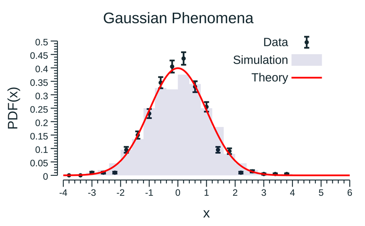

# Plotting with go



## Cheat sheet

Structure of the plotting tools (WIP):
```go
Figure
 |- canvas
    |- plot
       |- histogram
       |- functions
       |- legends
       |- axis
       |...
```

### (h)plot object

Plot borders

```go
p.Border.Right = 15
p.Border.Left = 5
p.Border.Top = 10
p.Border.Bottom = 5
```

Plot title

```go
p.Title = "Tiltle"
p.Title.Padding = 10
```

Label size and positions

```go
p.Title.TextStyle.Font.Size = 18
p.X.Label.TextStyle.Font.Size = 18
p.X.Label.Position = draw.PosRight
p.Y.Label.Position = draw.PosTop
```

Axis 
```go
p.X.Min, p.X.Max = xmin, xmax       // min & max for x-axis
p.X.Padding = 5                     // distance from y=0 for x-axis and x=0 for y-axis
p.X.Label.Text = "X label"          // Label of the x-axis
p.X.LineStyle.Width = 1.1           // Line width of the axis
p.X.LineStyle.Color = defaultBlack  // Line color of the axis
```

Ticks
```go
p.X.Tick.LineStyle.Width = 1.1      
p.X.Tick.LineStyle.Color = defaultBlack
p.X.Tick.Marker = plot.ConstantTicks([]plot.Tick{
			plot.Tick{pos1, "label"},
			plot.Tick{pos2, "label2"}, ...})
p.X.Tick.Label.Font.Size = 14          // Label (numbers) text style
p.X.Tick.Label.Color = defaultBlack    // Label (numbers) text style
```

Text 
```go
p.Title.TextStyle.Font.Size = 18
p.Title.TextStyle.Color = color.NRGBA{R: 30, G: 30, B: 30, A: 255}
// Change font?
```

Legend
```go
p.Legend.Add(obj, "name")	
p.Legend.Top, p.Legend.Left = true, false // position
p.Legend.YOffs = -0.25 * vg.Inch          // offset wrt to position
p.Legend.XOffs = -0.5 * vg.Inch           // offset wrt to position
p.Legend.Padding = 0.1 * vg.Inch          // padding of the legend
p.Legend.ThumbnailWidth = 0.3 * vg.Inch   // width of the legend
```

### 1HD object

Informations
```go
h.Infos.Style = hplot.HInfoNone
```

Line
```go
h.LineStyle.Color = color.NRGBA{R: 0, G: 0, B: 0, A: 30}
h.LineStyle.Width = 2
h.LineStyle.Dashes = []vg.Length{vg.Points(3), vg.Points(2)} // ---  ---  ---
```

Fill
```go
h.FillColor = color.NRGBA{R: 0, G: 0, B: 0, A: 30}
```

Marker style
```go
h.GlyphStyle = draw.GlyphStyle{
 	Shape:  draw.CircleGlyph{}, // type of marker
	Color:  color.NRGBA{R: 10}  // color of marker
	Radius: vg.Points(3)}       // size of marker
```

Error bar
```go
h.YErrs.LineStyle.Color = color.NRGBA{R: 10} // color of error bar
h.YErrs.LineStyle.Width = 2.5                // line width of the error bar   
h.YErrs.CapWidth = 8                         // size of perpendicular lines
```


## To-do's

- [ ] add a sub-plot grid with histograms, line, points, functions
- [ ] add a sub-plot grid with different styles (axis, margin, padding, etc ...) for the same data